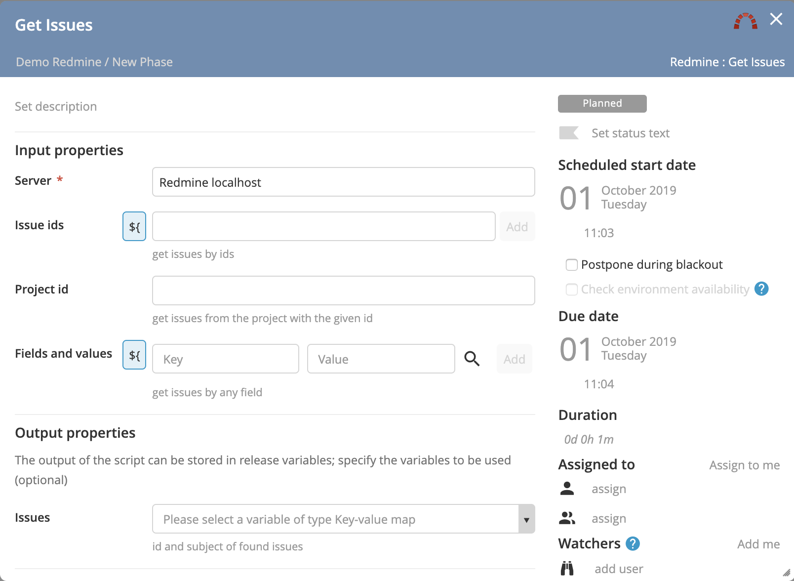
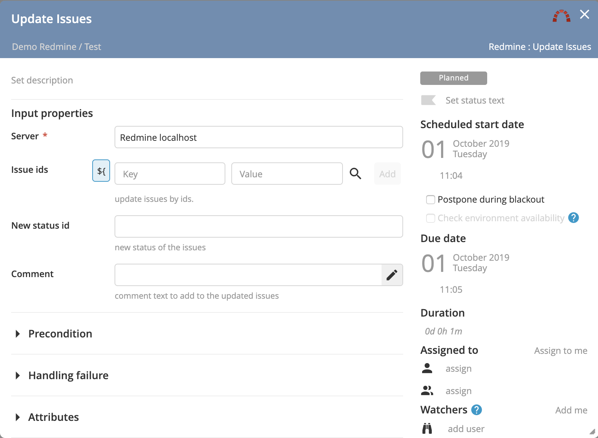
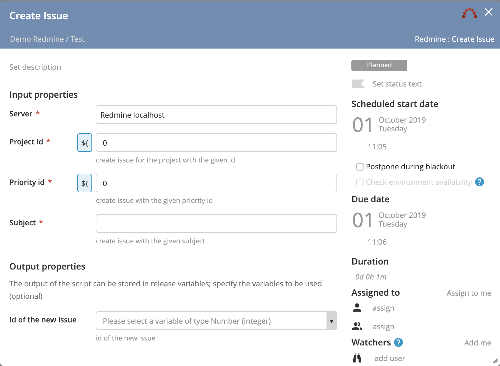

# XL Release Redmine plugin

[![Build Status][xlr-redmine-plugin-travis-image]][xlr-redmine-plugin-travis-url]
[![License: MIT][xlr-redmine-plugin-license-image]][xlr-redmine-plugin-license-url]
![Github All Releases][xlr-redmine-plugin-downloads-image]

[xlr-redmine-plugin-travis-image]: https://travis-ci.org/xebialabs-community/xlr-redmine-plugin.svg?branch=master
[xlr-redmine-plugin-travis-url]: https://travis-ci.org/xebialabs-community/xlr-redmine-plugin
[xlr-redmine-plugin-license-image]: https://img.shields.io/badge/License-MIT-yellow.svg
[xlr-redmine-plugin-license-url]: https://opensource.org/licenses/MIT
[xlr-redmine-plugin-downloads-image]: https://img.shields.io/github/downloads/xebialabs-community/xlr-redmine-plugin/total.svg

## Preface

This document describes the functionality provided by the XL Release Redmine plugin.

See the [XL Release reference manual](https://docs.xebialabs.com/xl-release) for background information on XL Release and release automation concepts.  

## Overview

The xlr-redmine-plugin is an XL Release plugin that allows you to integrate with Redmine.

## Requirements

* **XL Release Server** 9+

Note:  XLR version should not be lower than lowest supported version.  See <https://support.xebialabs.com/hc/en-us/articles/115003299946-Supported-XebiaLabs-product-versions>.

## Installation

* Copy the latest JAR file from the [releases page](https://github.com/xebialabs-community/xlr-redmine-plugin/releases) into the `RELEASE_SERVER/plugins` directory.
* Restart the XL Release server.

## Usage

### Get Issues task

### Update Issues task

### Create Issue task

## References

<https://www.redmine.org>
<https://www.redmine.org/projects/redmine/wiki/Rest_api>
